# Basashi Mod (馬刺しMOD)

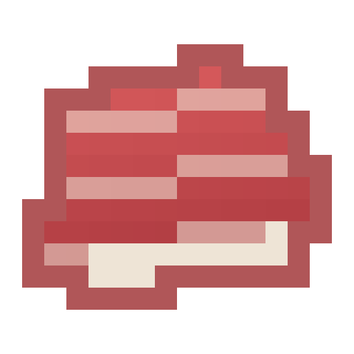

📖 **English** | [日本語](README-ja.md)

A food mod where you hunt horses to collect **Basashi** (horse sashimi) and cook it into a variety of horse-meat dishes.
It also adds horse-themed gameplay such as the Slaughter enchantment and Golden Wheat.

## ✨ Highlights

- 🐴 Horses drop **Basashi**; cook it into **Horse Tataki**
- 🍳 A variety of dishes: Yukke, Tartare Steak, Hamburg, and more
- 🌾 **Golden Wheat** to tame, breed, heal, and grow horses
- ⚔️ **Slaughter enchantment** (more drops from all animals, plus loot from babies)
- 🧑‍🍳 Trade with the **Butcher** villager, and craft various **horse armors**
- 🧩 **Multi-version support** (1.20.1 / 1.16.5 / 1.12.2 / 1.7.10)

---

## 📦 Supported versions

| Minecraft | Loader | Required dependency |
|---|---|---|
| 1.20.1 (recommended) | Forge / NeoForge | [Architectury API](https://www.curseforge.com/minecraft/mc-mods/architectury-api) |
| 1.16.5 | Forge | None |
| 1.12.2 | Forge | None |
| 1.7.10 | Forge | None |

> 1.20.1 is the most feature-complete, recommended version. Only 1.20.1 needs the "Architectury API" dependency; the others run by just dropping in the jar.

**Mod version vs. Minecraft version**

| Mod version | 1.20.1 | 1.16.5 | 1.12.2 | 1.7.10 |
|---|:---:|:---:|:---:|:---:|
| **v1.1.0** | ✅ | ✅ | ✅ | ✅ |
| v1.0.0 | ✅ | – | – | – |

---

## ⬇️ Download

Available from any of the following (the files are identical):

- [GitHub Releases](https://github.com/otnc/basashi-mod/releases)
- [Modrinth](https://modrinth.com/mod/basashi-mod) **(under review)**
- [CurseForge](https://www.curseforge.com/minecraft/mc-mods/basashi-mod) **(under review)**

> Modrinth / CurseForge pages are under review and may not be visible yet. In the meantime, please use GitHub Releases.

---

## 🔧 Installation

Open your Minecraft version and follow the steps.

<b>1.20.1 (Forge / NeoForge)</b>

1. Install **Forge** or **NeoForge** 1.20.1
2. Put the dependency **[Architectury API](https://www.curseforge.com/minecraft/mc-mods/architectury-api)** (1.20.1 / Forge build) into your `mods` folder
3. Put `basashi-1.20.1-x.x.x.jar` into your `mods` folder
4. Launch the game

> NeoForge is Forge-compatible, so this single jar works on both loaders.

<b>1.16.5 (Forge)</b>

1. Install **Forge** 1.16.5
2. Put `basashi-1.16.5-x.x.x.jar` into your `mods` folder (no dependency needed)
3. Launch the game

<b>1.12.2 (Forge)</b>

1. Install **Forge** 1.12.2
2. Put `basashi-1.12.2-x.x.x.jar` into your `mods` folder (no dependency needed)
3. Launch the game

<b>1.7.10 (Forge)</b>

1. Install **Forge** 1.7.10
2. Put `basashi-1.7.10-x.x.x.jar` into your `mods` folder (no dependency needed)
3. Launch the game

---

## 🍴 Items

| Item | How to get | Hunger | Saturation | Extra effect |
|------|------------|:---:|:---:|----------|
| Basashi | Kill a horse | 🍖×5 | 3.0 | — |
| Horse Tataki | Smelt Basashi / kill a burning horse | 🍖×10 | 16.0 | — |
| Horse Yukke | Craft: Basashi + Egg | 🍖×8 | 9.6 | — |
| Horse Tartare Steak | Craft: Basashi + Carrot + Egg | 🍖×13 | 23.4 | — |
| Horse Hamburg Steak | Smelt Horse Yukke | 🍖×10 | 16.0 | — |
| Loaded Horse Hamburg Steak | Smelt Horse Tartare Steak | 🍖×14 | 25.2 | — |
| Raw Horse Liver | Rare drop from horses | 🍖×8 | 4.8 | Regeneration II & Resistance II (5 min each) |
| Cooked Horse Liver | Smelt Raw Horse Liver | 🍖×15 | 24.0 | Regeneration II & Resistance II (5 min each) |
| Golden Wheat | Craft: Wheat + Gold Nugget | — | — | For use on horses only (see below) |
| Golden Bread | Craft: 3× Golden Wheat | 🍖×5 | 12.0 | Regeneration II (5s) & Absorption I (2 min) |

> "Hunger" is the food bar restored; "Saturation" is a hidden value that affects how slowly hunger depletes.

---

## 🎮 Gameplay & features

### 🐴 Drops & cooking

- **Kill a horse** → drops Basashi (amount increases with Looting / Slaughter)
- **Kill a burning horse** → drops Horse Tataki directly
- **Kill a horse** → also has a chance to drop bones, and rarely Raw Horse Liver
- **Smelt** (furnace / smoker / campfire) → Basashi→Tataki, Yukke→Hamburg, Tartare→Loaded Hamburg, Raw Liver→Cooked Liver

### 🌾 Golden Wheat

Use it on a horse for the following effects depending on the situation (it cannot be eaten):

- **Taming** (raises an untamed horse's temper, with a chance to tame it)
- **Breeding** (puts a tamed adult horse into love mode)
- **Healing** (restores health)
- **Growth** (speeds up a foal's growth)

### ⚔️ "Slaughter" enchantment

A weapon/axe enchantment, **Slaughter I–III**. It increases the **drop count and rare-drop rate from all animals** (including this mod's own drops). It can be obtained from enchanting tables, books, etc., and stacks with other drop-boosting effects.

It also lets you get loot from **baby animals**, which normally drop nothing:

| Level | Baby animals |
|---|---|
| Slaughter I | No drops (only the adult count / rare-rate boost) |
| Slaughter II | Drops the same as adults (no count bonus) |
| Slaughter III | Drops the same as adults (with count bonus) |

> On 1.7.10 only, the rare-drop-rate boost is not supported (the drop-count increase and baby-animal drops still work).

### 🧑‍🍳 Butcher trades

You can trade with the "Butcher" villager: buying Basashi, selling various horse-meat dishes and Golden Wheat (the lineup grows as the Butcher levels up).

### 📋 Recipes

Show all recipes (crafting & smelting)

#### 🛠 Crafting

| Item | Ingredients | Recipe |
|---|---|---|
| Horse Yukke | Basashi + Egg (shapeless) | 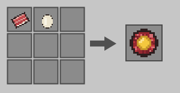 |
| Horse Tartare Steak | Basashi + Carrot + Egg (shapeless) | 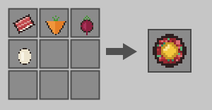 |
| Golden Wheat | Wheat + Gold Nugget | 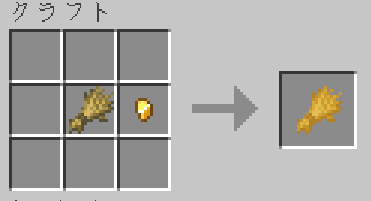 |
| Golden Bread | 3× Golden Wheat (in a row) | 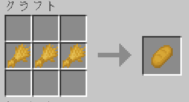 |
| Iron Horse Armor | Iron Ingots | 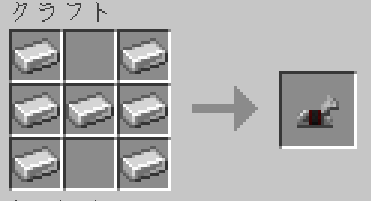 |
| Golden Horse Armor | Gold Ingots | 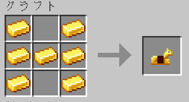 |
| Diamond Horse Armor | Diamonds | 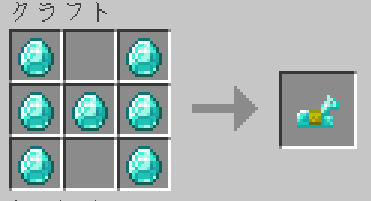 |

> Iron/Gold/Diamond horse armors are hard to obtain in vanilla, so they are made craftable. On versions that have leather horse armor (1.16.5 / 1.20.1) you can simply use the vanilla recipe.

#### 🔥 Smelting (furnace / smoker / campfire)

| Smelt into | Recipe |
|---|---|
| Basashi → Horse Tataki | 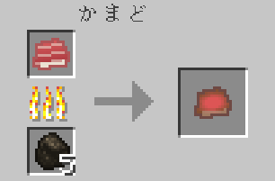 |
| Horse Yukke → Horse Hamburg Steak | 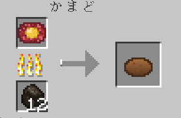 |
| Horse Tartare Steak → Loaded Horse Hamburg Steak | 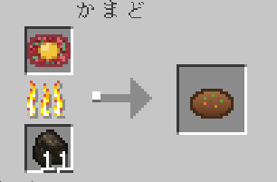 |
| Raw Horse Liver → Cooked Horse Liver | 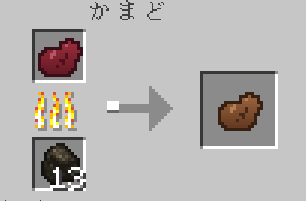 |

---

## 🔄 Update compatibility

When you update from an older version, items in existing worlds are carried over automatically (old IDs `uma_*` are remapped to the new `horse_*` IDs).

---

## 📜 License

[MIT License](LICENSE) © otoneko.

## 🛠 For developers

See [CONTRIBUTING.md](CONTRIBUTING.md) for build, dev-environment, and release instructions. Design details are in [DESIGN.md](DESIGN.md).
